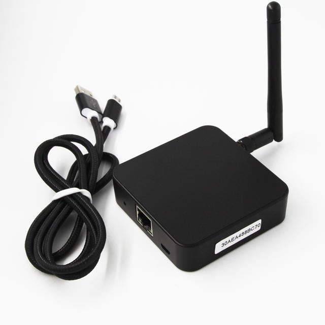

# April Brother (AB) BLE Gateway - Enhanced

## Overview

This Home Assistant integration allows forwarding BLE data from the AprilBrother BLE Gateway V4 to the Home Assistant [bluetooth component](https://www.home-assistant.io/integrations/bluetooth/).

AprilBrother BLE Gateway V4 is an ESP32- and NRF52832-based BLE to network gateway and bridge. It reads BLE advertisement data such as iBeacon, Eddystone or customized format data and sends to LAN/internet server via MQTT.

## Features

- Automatic discovery of gateways on the network (via SSDP)
- Support for MQTT forwarding
- Integration with Home Assistant's built-in Bluetooth component
- Validated MQTT settings during setup

## Installation

This project consists of two parts that must be installed separately:

1. **AB BLE Gateway Integration** - The core integration installed via HACS
2. **Enhanced BLE Discovery Add-on** - An optional but recommended add-on for device management

### Part 1: Install the Integration via HACS

1. Add this repository to HACS as a custom repository
2. Install the "April Brother BLE Gateway - Enhanced" integration through HACS
3. Restart Home Assistant
4. Add the integration through the Home Assistant UI (Configuration → Integrations → Add Integration)
5. Select "April Brother BLE Gateway - Enhanced" and follow the setup instructions

### Part 1 Alternative: Manual Installation

1. Copy the `custom_components/ab_ble_gateway` directory to your Home Assistant `custom_components` directory
2. Restart Home Assistant
3. Add the integration through the Home Assistant UI

### Part 2: Install the Enhanced BLE Discovery Add-on

The Enhanced BLE Discovery add-on provides a user-friendly dashboard and management tools for your BLE devices.

1. In Home Assistant, navigate to **Settings** → **Add-ons** → **Add-on Store**
2. Click the three-dot menu (⋮) in the top right and select **Repositories**
3. Add this repository URL: `https://github.com/festion/hass-ab-ble-gateway-suite`
4. Click **Add** and then **Close**
5. The "Enhanced BLE Device Discovery" add-on should now appear in the add-on store
6. Click on it and then click **Install**
7. After installation, click **Start** to run the add-on
8. The dashboard will be available at: /lovelace/ble-utility

## Setup Requirements

1. Set up the [MQTT component](https://www.home-assistant.io/integrations/mqtt/) in Home Assistant
2. Configure the gateway to use MQTT (connection type 3)
3. Ensure gateway MQTT settings match Home Assistant's MQTT configuration
4. Provide MQTT Topic and MQTT ID Prefix during setup

## Support

For issues, questions, or feature requests, please open an issue on GitHub.